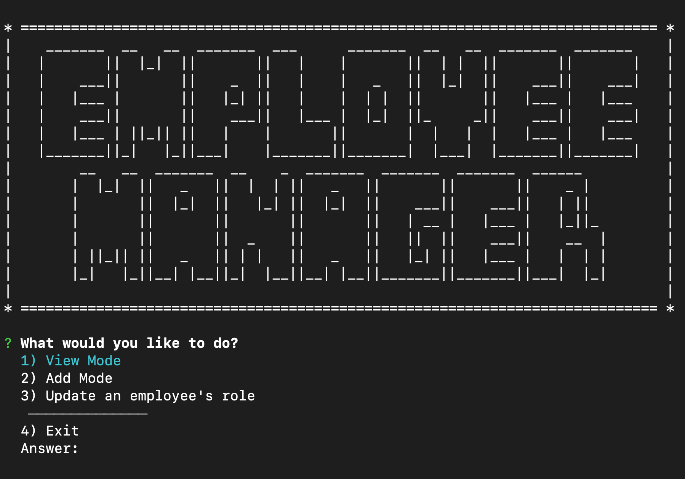

# Employee Tracker

[](https://www.codacy.com/manual/thadkingcole/employee_tracker?utm_source=github.com&amp;utm_medium=referral&amp;utm_content=thadkingcole/employee_tracker&amp;utm_campaign=Badge_Grade)

[](LICENSE)
[](code_of_conduct.md)

An employee management system CLI made with node, inquirer, & mysql.



## Table of Contents

- [Installation](#installation)
- [Usage](#usage)
- [Contributing](#contributing)
- [Questions](#questions)
- [Credits](#credits)
- [License](#license)

## Installation

First, clone this repository using your preferred method, SSH:

```git
git clone git@github.com:thadkingcole/employee_tracker.git
```

or HTTPS:

```git
git clone https://github.com/thadkingcole/employee_tracker.git
```

Once the repo is cloned, navigate into its root directory and run "npm i" to install the require dependencies.

```console
cd employee_tracker
npm i
```

You are now ready to start using the app!

[back to Table of Contents](#table-of-contents)

## Usage

Check out this short [video](https://drive.google.com/file/d/18-OnXG7otatBESwR1K5Rhgq5Ka3qE4ql/view) demostrating the features of this app.

To start the app, run ```npm start``` from its repo's root directory in your console of choice.

Follow the prompts as laid out on the screen. You can use the arrow keys to choose between different choice lists, or type the number associated with the desired choice.

Currently, the app is able to do the following:

- view all employees
- view employees by department
- view list of roles
- add new employee
- add new role
- add new department
- edit/update an employee's role

[back to Table of Contents](#table-of-contents)

## Contributing

Your contribution is most welcome! Please refer to the contributing guidelines when making contributions to this project.

Please note that this project is released with a [Contributor Code of Conduct](code_of_conduct.md). By Participating in this project, you agree to abide by its terms.

[back to Table of Contents](#table-of-contents)

## Questions

Please direct any and all questions to [thadkingcole](https://github.com/thadkingcole) or via email at [thadjcole@gmail.com](mailto:thadjcole@gmail.com).

[back to Table of Contents](#table-of-contents)

## Credits

I would like to thank the following people/projects/resources:

- [manytools.org ascii banner generator](https://manytools.org/hacker-tools/ascii-banner/) for the "Employee Manager" main menu banner

[back to Table of Contents](#table-of-contents)

## License

[MIT](LICENSE) copyright (c) 2020 [Thaddeus Cole](mailto:thadjcole@gmail.com).

[back to Table of Contents](#table-of-contents)
